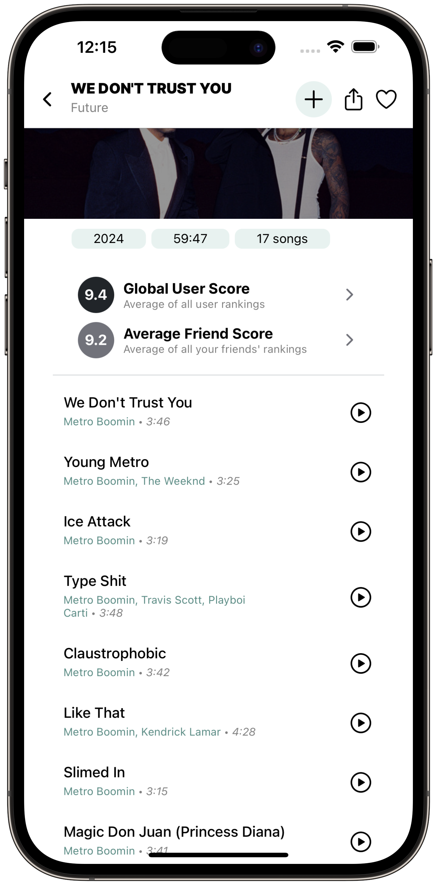
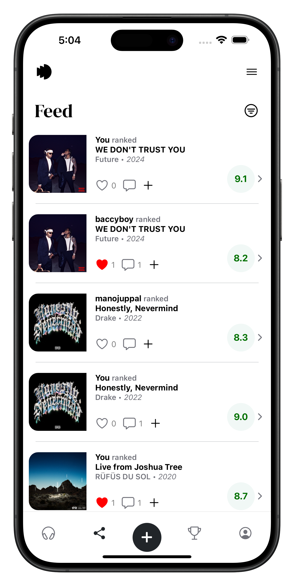

# Echo

Echo is a music social app that allows users to rate and rank albums, keep up with their friends' music preferences, and discover new music.

Echo is built using Typescript, React Native, Expo, Express, Zustand, and Supabase.

 

